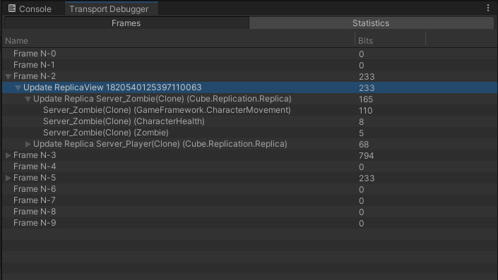
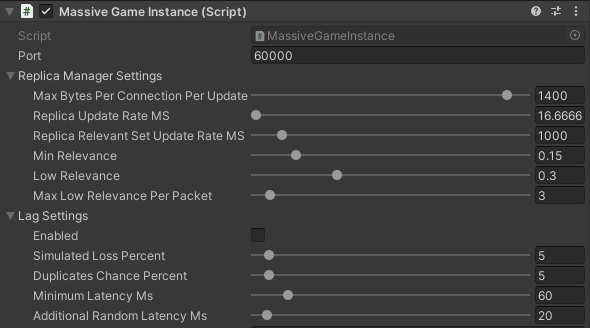

# Cube
Cube is a complete library for game multiplayer support for [Unity](https://unity.com/) games. It's simple to use while being robust and scalable (16+ players). It's best suited for action games with little static data. Works with an Unreal style [Gameplay Framework](https://github.com/MKSQD/GameFramework).

The network model is mainly based on the Tribes network model and [GDC Vault: I Shot You First! Gameplay Networking in Halo: Reach](http://www.gdcvault.com/play/1014345/I-Shot-You-First-Networking). This means the bandwith per connection is predefined and only the most important, priorized information is stuffed into each single packet. The lower the available bandwidth the least detailed the client simulation becomes.

More importantly, in-editor client/server development is supported. Prefabs for network objects are discovered automatically together with tagged ScriptableObjects. Networked objects can be placed into a scene and behave like any other networked object. Rpcs, used as unreliable flavour events, are normal function calls rewritten via Cecil.

The transport layer is based on a plugin mechanism. Currently there's [LiteNetLib](https://github.com/RevenantX/LiteNetLib) support.





## Compared to MLAPI (Netcode for GameObjects)/UNet
- Explicit Serialize/Deserialize, no magic NetworkVariables or lists
- True multiplayer in editor
- Almost no docs - you are expected to read the code and learn with examples
- Nothing is sent reliably and thus, in theory, we are more scalable (more networked objects, more players) and more robust to bad network conditions
- ... this, on the contrary, means we use alot more bandwidth over time
- Support for non-value type RPC arguments (tagged ScriptableObjects, ...)


## Getting Started
Clone the git repository into your **Assets** folder.

Put CubeClient and CubeServer components on 2 GameObjects in the scene.


## Replication
A **Replica** is replicated from the server to all clients. Replicas must always be instances of prefabs for Cube to be able to create client instances of them.


Create a new *GameObject* in the scene. Add the *Cube/Replica* component to mark it as an Replica.
Add the *Cube/ReplicaTransform* component to keep their transforms synchronized.

Then create a prefab *TestReplica* from it by dragging the GameObject into the project explorer. Delete the original instance.

Create a new script TestServerGame:
```C#
using Cube.Networking;
using Cube.Replication;
using Cube.Transport;
using UnityEngine;


public class TestServerGame : ServerGame {
    public GameObject prefab;

    protected override void OnNewIncomingConnection(Connection connection, BitStream bs) {
        // Create a new ReplicaView for this Connection
        var view = new GameObject("ReplicaView " + connection);
        view.transform.parent = transform;

        var rw = view.AddComponent<ReplicaView>();
        rw.connection = connection;
        
        server.replicaManager.AddReplicaView(rw);

        // Instantiate some Replica
        server.replicaManager.InstantiateReplica(prefab);
    }
}
```
Replace the *ServerGame* component on the ServerGame scene GameObject. Assign TestReplica to it's prefab field.

A **ReplicaView** observes Replicas for a connection. Its position and settings is used to scope and priorize which Replicas to send. Without a ReplicaView the client will not receive any Replicas.

Start the game now and you should see the Replica prefab being replicated. Try to move around the server-side instance in the editor.

For the client to instantiate a different prefab, rename your prefab to *Server_TestReplica*
and create a new prefab variant *Client_TestReplica* (The name prefixes **Server_** and **Client_** are important). 

#### ReplicaBehaviour instead of MonoBehaviour
ReplicaBehaviour derives from MonoBehaviour and is used to implement multiplayer related functionaly on a Replica.
The server/client members can be used to access the Cube instance the Replica is part of. Rpcs are only available for ReplicaBehaviours.

```C#
using Cube.Replication;
using UnityEngine;

public class Test : ReplicaBehaviour {
    void DoTest() {
        if (!isServer)
            return;

         RpcTest();
    }
    
    [ReplicaRpc(RpcTarget.Client)]
    void RpcTest() {
        Debug.Log("Client rpc called");
    }
}
```

#### Replica ownership
Each Replica has an owning (Replica.owner) connection. Assign ownership with **Replica.AssignOwnership** and take it away with **Replica.TakeOwnership**. Only the server can set and remove ownership. Ownership information is sent to the owning client. 

### ReplicaRpc
ReplicaBehaviours can send **unreliable** rpcs. Rpcs are prioritized aggressively, so never rely on these to transmit actual gameplay state. Instead, these should be used for additional, optional effects and cues. 

Rpcs can only be private functions with an \[ReplicaRpc(...)] attribute and its name starting with Rpc.

```C#
using Cube.Replication;
using UnityEngine;

public class TestReplica : ReplicaBehaviour {
    void Update() {
        if (!isServer)
            return;

        RpcTest();
    }

    [ReplicaRpc(RpcTarget.Client)]
    void RpcTest() {
        Debug.Log("Client rpc called");
    }
}
```
